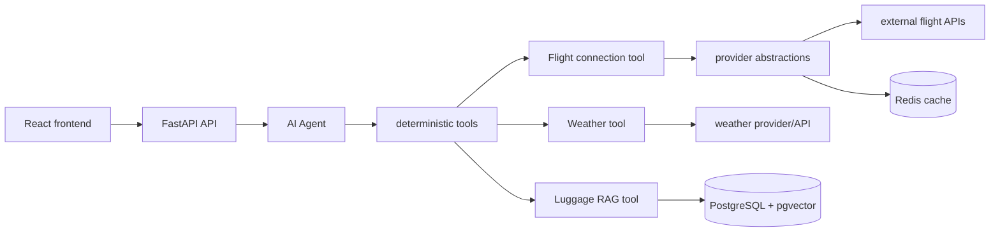

# willimakeit

Will I Make It is a small flight-assistance app. The backend is a FastAPI API with
an Ollama-powered assistant that can check flight connections, airport transfer
rules, airport weather, and airline baggage rules.

The React frontend is a thin client that sends user questions to
`POST /assistant/ask`.

## Architecture



The LLM is responsible for interpreting the user's request, selecting the right
tool, and composing the final answer. The tools and services handle deterministic
work: fetching flight schedules, applying transfer-time rules, calculating
connection risk, retrieving weather data, and searching stored airline baggage
rules.

Provider abstractions are used around external systems such as AeroDataBox,
Open-Meteo, and Ollama embeddings. This keeps service code independent from a
specific API client and makes providers easier to replace or fake in tests.
Redis is currently used to cache repeated flight lookup responses.

## Current Limitations

Flight connection checking is currently scoped to a limited set of airports and
seeded transfer rules:

- `CDG` - Paris Charles de Gaulle Airport
- `FRA` - Frankfurt Airport
- `LHR` - London Heathrow

The luggage RAG knowledge base currently contains baggage rules for:

- Wizz Air
- Ryanair

This is the current project scope. More airports, transfer rules, and airlines
can be added later by extending the database seed/migration data and ingestion
source data.

## Project Structure

- `apps/api` - FastAPI backend, agent setup, tools, providers, services,
  database models, Alembic migrations, and backend tests.
- `apps/web` - Vite React frontend.
- `package.json`, `pnpm-workspace.yaml`, `turbo.json` - pnpm workspace and Turbo
  task configuration.

## Running Locally

### Requirements

- Python `>=3.14`
- `uv`
- Node.js with `pnpm` `11.12.0`
- Docker, for PostgreSQL + pgvector and Redis
- Ollama
- AeroDataBox RapidAPI key

### Backend Environment

Create `apps/api/.env` from `apps/api/.env.example` and set the real values:

### Start Dependencies

From `apps/api`:

```sh
docker compose up -d postgres redis
```

Start Ollama separately and pull the configured models:

```sh
ollama pull qwen3:4b
ollama pull qwen3-embedding:0.6b
```

### Install Dependencies

From the repository root:

```sh
pnpm install
```

From `apps/api`:

```sh
uv sync
```

### Database Setup

From `apps/api`:

```sh
uv run alembic upgrade head
uv run python -m willimakeit.scripts.ingest_airline_rules
```

The migrations create the airport, transfer-rule, and `pgvector`-backed airline
rule chunk tables. The ingestion script embeds the sample Wizz Air and Ryanair
rules with Ollama and inserts them into PostgreSQL.

### Start the App

Backend, from `apps/api`:

```sh
uv run uvicorn willimakeit.main:app --reload
```

Frontend, from the repository root:

```sh
pnpm run dev:web
```

The frontend expects the backend at `http://localhost:8000` and Vite serves the
frontend at `http://localhost:5173` by default.

### Tests and Checks

Backend tests, from `apps/api`:

```sh
uv run pytest
```

Backend lint/typecheck, from `apps/api`:

```sh
uv run ruff check src tests
uv run mypy src
```

Frontend checks, from the repository root:

```sh
pnpm --filter web lint
pnpm --filter web typecheck
pnpm --filter web build
```
